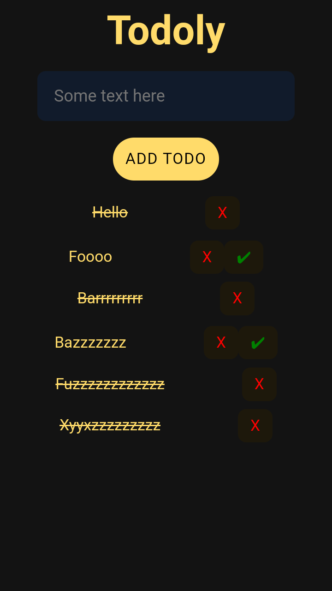

# Todoly
- A simple todo web app (PWA)
- **Try it now: [Todoly](https://t4p4n.github.io/todoly/)**
## Features
- Localstorage
  - Todos will stay on page even if you reload it
- ~~Strikethrough~~
  - Mark todos as done by tapping the check button
  - Double tap to undo.
- Delete todos
  - Delete your todos when you are done with them. use X button
- Animations
  - Cool Animations from [Animate.css](https://animate.style/)
 
## Screenshots
 
  
## Video Demo
 [click me to watch the video](https://m.youtube.com/watch?v=GIoeLtJO4Mk)

